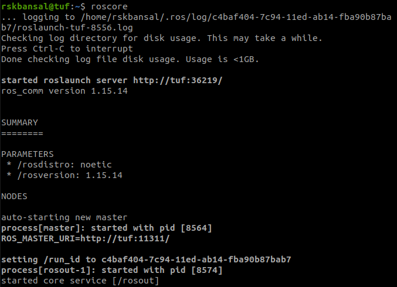
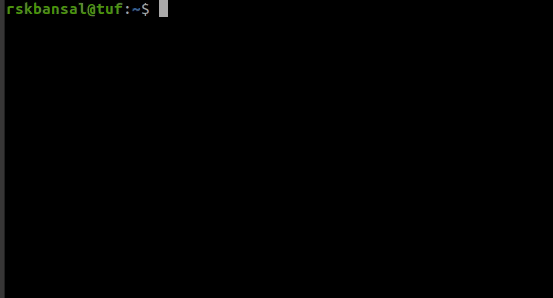
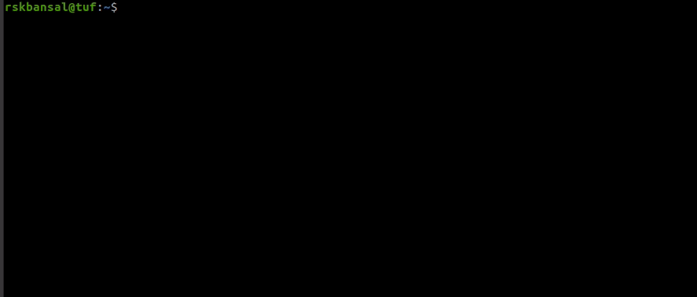
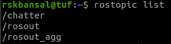
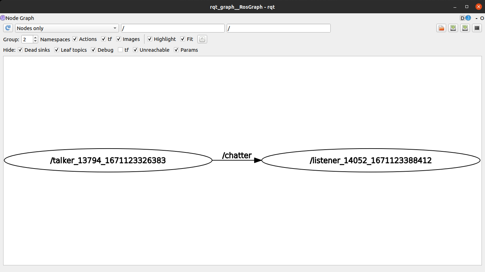

# Learning ROS - OOP Special Project
- [Installing the right Operating System](#installing-the-right-operating-system)
- [Installing ROS](#installing-ros)
- [Why Terminator ?](#why-terminator--)
- [1st Implementation : Talker-Listener](#1st-implementation--talker-listener)
- [References](#references)
- [Credits](#credits)

## Installing the right Operating System
Robotics Development relies heavily on **Linux**. It is recommended to install [Ubuntu 20.04 LTS (Focal Fossa)](https://releases.ubuntu.com/focal/). You can either dual boot your computer or install it in a virtual machine.<br><br>
If you are a **Windows** user, it is best to dual boot your computer. You can use tools like [Ventoy](https://www.ventoy.net/) for creating a bootable USB. If you are using a virtual machine, you can use [VirtualBox](https://www.virtualbox.org/).<br><br>
If you are a **MacOS** user, it is not a viable option to dual boot your computer. It is recommended that you use [UTM](https://mac.getutm.app/) and install the ARM image of Ubuntu.

## Installing ROS
The Robot Operating System (ROS) is a set of software libraries and tools that help you build robot applications. From drivers to state-of-the-art algorithms, and with powerful developer tools, ROS has what you need for your next robotics project. And it's all open source.<br><br>
Ubuntu 20.04 supports ***ROS Noetic***. To install the same, follow the instructions on [ROS Wiki](http://wiki.ros.org/noetic/Installation/Ubuntu). Once you have successfully installed ROS, you may try the [1st implementation : Talker-Listener](#1st-implementation--talker-listener).

## Why Terminator ?
It is recommended to install **Terminator**. It is a terminal emulator that allows you to split your terminal window into multiple terminals, each running a different shell, inside a single window. It is useful for running multiple ROS nodes at the same time. You can install it using the following command:
```bash
$ sudo apt install terminator
```
Some shortcuts :-
- <kbd>Ctrl</kbd> + <kbd>Shift</kbd> + <kbd>E</kbd> : Split the current terminal horizontally
- <kbd>Ctrl</kbd> + <kbd>Shift</kbd> + <kbd>O</kbd> : Split the current terminal vertically
- <kbd>Ctrl</kbd> + <kbd>Shift</kbd> + <kbd>W</kbd> : Close the current terminal
- <kbd>Ctrl</kbd> + <kbd>Shift</kbd> + <kbd>C</kbd> : Copy the selected text
- <kbd>Ctrl</kbd> + <kbd>Shift</kbd> + <kbd>V</kbd> : Paste the clipboard text

## 1st Implementation : Talker-Listener
Now, we can move on to running our first nodes. Lets create a publisher and a subscriber! Our `talker` will be printing "hello world" with timestamps at regular intervals and our `listener` will capture those messages at the same time.

### `roscore`
Start a ***roscore*** instance in a new terminal. This will start a master node which will be responsible for managing all the nodes in the system.
```bash
$ roscore
```

### `talker`
Open a new terminal and run the following command to start the `talker` node. This will start a publisher node which will be publishing messages at regular intervals.
```bash
$ rosrun rospy_tutorials talker
```

### `listener`
Open a new terminal and run the following command to start the `listener` node. This will start a subscriber node which will be listening to the messages published by the `talker` node.
```bash
$ rosrun rospy_tutorials listener
```


### `rostopic`
Open a new terminal and run the following command to see the list of running topics.
```bash
$ rostopic list
```

### `rqt_graph`
Open a new terminal and run the following command to see the graph view of the running nodes and topics.
```bash
$ rqt_graph
```


## References
- [ROS Wiki](https://wiki.ros.org/)
- [Programming Robots with ROS](/Programming_Robots_with_ROS.pdf)

## Credits
- Rhythm Bansal (2021A7PS2430G)
- Krishna Sethiya (2021A7PS1440G)
- Shubham Shah (2021A7PS2444G)
- Jatin Dahiya (2021A7PS2067G)